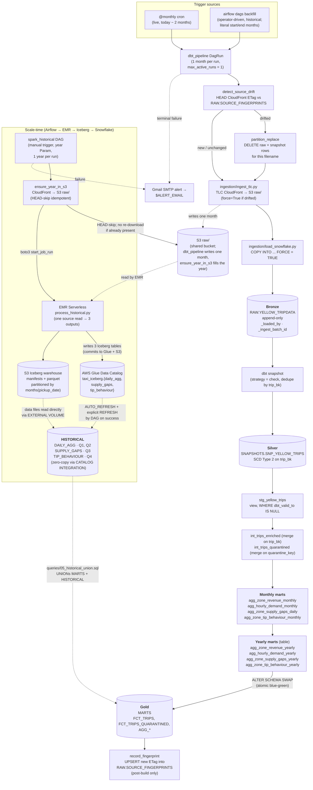
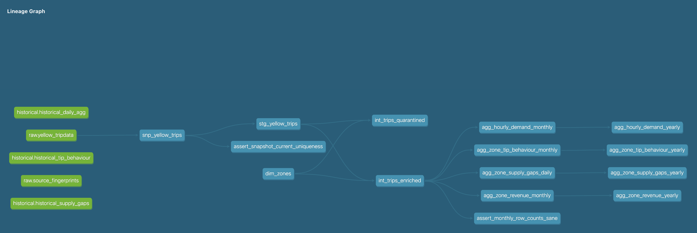

# NYC TLC Yellow Taxi — Data Platform

[](https://github.com/karunkumarjha/taxi-platform/actions/workflows/ci.yml)

End-to-end data platform over the NYC TLC Yellow Taxi 2023 dataset
(~38M rows across 12 monthly Parquet files, scaling to ~1.5B rows when
historical years are added). AWS + Snowflake provisioned by a single
`terraform apply`. Two Airflow DAGs drive ingest and transformation. A
medallion (Bronze / Silver / Gold) layout in Snowflake gives full audit
history and SCD Type 2 versioning for retroactive TLC corrections.

## Video walkthroughs

Watch this first — a one-shot code walkthrough plus a live end-to-end
run. The README below has the same content in text form for reference.

- **[Taxi Platform — code walkthrough and end-to-end run](https://drive.google.com/file/d/1TIV1tkNmbRhdhN273OEJwoL9SymTFghi/view?usp=sharing)**
  — repo tour followed by a full demo from a fresh clone through
  `./scripts/bootstrap.sh` to the Airflow DAGs running and data landing
  in Snowflake.

## Table of contents

- [Video walkthroughs](#video-walkthroughs)
- [Architecture](#architecture)
  - [Medallion layout in Snowflake](#medallion-layout-in-snowflake)
  - [Architecture decisions worth calling out](#architecture-decisions-worth-calling-out)
- [Prerequisites](#prerequisites)
- [Setup](#setup)
  - [Backfill (optional)](#backfill-optional)
  - [Teardown](#teardown)
- [Operational reference](#operational-reference)
- [Failure alerts](#failure-alerts)
- [dbt docs](#dbt-docs)
- [Data quality](#data-quality)
- [How the platform answers the four business questions](#how-the-platform-answers-the-four-business-questions)
- [Repo layout](#repo-layout)
- [Brainstormer answers](#brainstormer-answers)
- [AI tools](#ai-tools)
- [Trade-offs and shortcuts](#trade-offs-and-shortcuts)

## Architecture



**dbt lineage** (auto-generated by `dbt docs`):



The graph above is the dbt-only view: `RAW.YELLOW_TRIPDATA` → SCD
snapshot → staging view → intermediate (enriched + quarantined) →
4 monthly mart aggregates → 4 yearly mart aggregates (derived from
the monthly marts). Singular tests
(`assert_snapshot_current_uniqueness`, `assert_monthly_row_counts_sane`)
hang off the layers they protect. Reproduce locally with `make docs`
(regenerates `docs/lineage_graph.png` after any model topology change).

**Single owner of transformation logic: dbt.** All validation,
enrichment, dedup, and aggregation live in dbt — no engine drift, no
PySpark transformation code to keep in sync with SQL.

**Two DAGs.**

`dbt_pipeline` (`@monthly`) — live monthly increments. Per run:
detect drift → partition-replace if drifted → ingest one TLC parquet →
COPY into RAW → full dbt build (snapshot → staging → intermediate →
marts → swap) → record fingerprint. One month per DagRun, scoped via
`target_year` / `target_month` vars. Historical backfills run through
the same DAG via UI Backfill or `make dbt-backfill`.

`spark_historical` (manual-trigger) — bulk pre-aggregation on EMR
Serverless. The DAG submits via boto3, waits via reschedule sensor,
then creates + refreshes the Iceberg table in Snowflake. Snowflake
reads the same manifests Glue holds via `CATALOG INTEGRATION` —
zero-copy. The `HISTORICAL` schema is outside the blue-green swap;
Spark writes follow Iceberg's own atomic-commit semantics.

**Airflow is the control plane, even for Spark.** Spark runs on EMR
Serverless; the DAG only submits and observes. dbt remains sole owner
of the medallion layers.

### Medallion layout in Snowflake

| Layer | Schema.Table | Materialization | Purpose |
|---|---|---|---|
| **Bronze** | `RAW.YELLOW_TRIPDATA` | append-only table | Every COPY writes new rows (`FORCE = TRUE`). `_ingest_batch_id` (UUID per call) and `_loaded_by` (`dbt_pipeline` / `manual`) make every load event auditable. |
| **Silver** | `SNAPSHOTS.SNP_YELLOW_TRIPS` | dbt snapshot, SCD Type 2 | `unique_key = trip_bk` (md5 of the 5 immutable trip identifiers — vendor + pickup_ts + dropoff_ts + pu/do_location_id). `strategy = 'check'` versions the 15 mutable financial/operational columns. TLC corrections (re-published rows with adjusted fares, etc.) close the previous SCD version and open a new one. |
| **Gold (live)** | `MARTS.FCT_TRIPS` + aggregates | incremental, `merge` on trip_bk | Staging reads the snapshot `WHERE dbt_valid_to IS NULL` (dbt's idiom for "current SCD version") so Gold reflects the latest TLC version. The merge upserts each month's rows by `trip_bk` — corrections overwrite stale rows in place, no manual rebuild needed. Lives behind the blue-green swap. |
| **Gold (historical)** | `HISTORICAL.DAILY_AGG` (Q1, Q2) + `SUPPLY_GAPS` (Q3) + `TIP_BEHAVIOUR` (Q4) | Iceberg tables, Glue catalog | Three pre-aggregated tables written by `spark_historical` on EMR Serverless — one Spark application produces all three from a single source read. Snowflake reads zero-copy via `CATALOG INTEGRATION` to AWS Glue — no data duplication. Lives in its own schema, NOT touched by the blue-green swap. |

The whole thing is built behind a blue-green swap: dbt writes to
`MARTS_BUILD` (cloned from `MARTS` at the start of every run), tests
run against `MARTS_BUILD`, and only on full success does
`ALTER SCHEMA MARTS_BUILD SWAP WITH MARTS` flip the consumer-facing
schema atomically. Test failure → swap skipped → consumers keep
reading the previous good build.

### Architecture decisions worth calling out

- **Single `terraform apply` across AWS + Snowflake.** The classic
  storage-integration ↔ IAM-role circular dependency is broken by
  *predicting the IAM role ARN* and giving it to the integration as a
  string at create time.

- **`trip_bk`, not the natural-key tuple.** The 5 immutable columns
  define a stable surrogate key. Mutable financial columns (fare,
  payment, distance) are intentionally excluded — they're the exact
  columns TLC retroactively corrects, and including them in the key
  would block the correction from reaching Gold.

- **Fingerprint-based source drift detection + partition replace on
  republish.** Every DagRun starts with `detect_source_drift`: HEAD
  CloudFront, compare ETag against `RAW.SOURCE_FINGERPRINTS`. On
  `drifted` (TLC republished a corrected file), `partition_replace_if_drifted`
  wipes raw + snapshot rows for that filename and ingest
  force-re-downloads. Mutable-column corrections flow through SCD2 in
  the normal path; partition replace is the fix for the rare immutable-field
  correction (where a new `trip_bk` would otherwise orphan the old SCD
  row — we don't fuzzy-match across that). Fingerprint upserted only
  after build success, so a failed run retries cleanly.

- **Mart split: monthly grain + yearly tables, no in-mart detection.**
  Airflow passes `target_year` / `target_month`; the four monthly /
  daily marts rebuild that month via `delete + insert`. The four
  yearly marts are tables derived from the monthly marts (~3k rows per
  year to read, not 38M from FCT_TRIPS). Old count-comparison CTEs
  (`years_to_rebuild` / `months_to_build`) are gone — the orchestrator
  owns "what to rebuild."

- **`quarantine_key` for invalid-row dedup.** Quarantined rows can have
  NULL pickup_ts (`null_timestamp` category), so `merge`'s equality
  check needs a non-null surrogate. `quarantine_key` is computed from
  the natural columns plus `source_filename` with dbt_utils's null
  sentinel — never NULL by construction.

- **Append-only RAW with `_loaded_by`.** `FORCE = TRUE` and a UUID
  batch_id let every load event accumulate in RAW for full forensic
  history. `_loaded_by` distinguishes which pipeline produced each row,
  answering "did spark or the live monthly run load 2024-03?" with one
  query.

- **Per-month dbt isolation with `max_active_runs=1`.** One DagRun =
  one month; 12 queued runs serialize sequentially. A 2024-03 failure
  doesn't block 2024-04+ — they run in queue order, failure surfaces
  per-month in the UI.

- **`@monthly` schedule, not `@daily`.** TLC publishes monthly with a
  ~2-month lag. The pipeline is idempotent so `@daily` would *work*,
  but it'd produce ~30 no-op runs per month — we match cadence to
  publishing reality. Ad-hoc runs via UI conf or `make dbt-backfill`.

- **Blue-green deploy with clone-before-build.** Each run does
  `CREATE OR REPLACE TRANSIENT TABLE MARTS_BUILD.<t> CLONE MARTS.<t>`
  per table at the start (preserves FUTURE-TABLE grants vs schema-level
  CLONE), runs dbt, then `ALTER SCHEMA MARTS_BUILD SWAP WITH MARTS`.

- **All 20 source columns preserved.** `FCT_TRIPS` keeps every column
  from the TLC schema (cast + renamed only — never dropped) plus
  derived columns, zone enrichment, and load metadata.
  `cbd_congestion_fee` (added in TLC's 2025 schema) is included with
  NULL fallback for older parquet files that lack the field.

- **Snowflake `STORAGE INTEGRATION`** assumes an IAM role to read S3.
  No AWS access keys stored in Snowflake; trust via `sts:AssumeRole`
  with auto-rotated external ID.

- **Three Snowflake roles**, least privilege:
  - `LOADER` — INSERT/SELECT on `RAW.YELLOW_TRIPDATA` only
  - `DBT` — OWNERSHIP on `MARTS_BUILD` + `MARTS` (needed for SWAP),
    `SNAPSHOTS` (Silver SCD), and `HISTORICAL` (Iceberg); SELECT on RAW;
    USAGE on the EXTERNAL VOLUME + CATALOG INTEGRATION
  - `ANALYST` — SELECT across all schemas (RAW, SNAPSHOTS, MARTS,
    HISTORICAL); no writes anywhere. Used by ad-hoc queries and any
    external BI tool

## Prerequisites

- AWS account with `aws sts get-caller-identity` working
- Terraform ≥ 1.6
- Snowflake trial (Standard) — sign up at signup.snowflake.com
- Docker Desktop (for Astro CLI)
- Astro CLI (`brew install astro`) — runs Astro Runtime 3.0-14
  (Apache Airflow 3.0.6)
- uv (`brew install uv`)
- Python 3.11+

## Setup

**Two manual prerequisites** (one-time, ~5 minutes total):

1. **Snowflake service user.** In Snowsight as `ACCOUNTADMIN`:

   ```sql
   USE ROLE ACCOUNTADMIN;
   CREATE USER IF NOT EXISTS TF_USER
       PASSWORD             = '<choose-something-strong>'
       DEFAULT_ROLE         = ACCOUNTADMIN
       DEFAULT_WAREHOUSE    = COMPUTE_WH
       MUST_CHANGE_PASSWORD = FALSE;
   GRANT ROLE ACCOUNTADMIN TO USER TF_USER;
   ```

   You can also do this when bootstrap prompts you — it prints this SQL
   block right before asking for the password.

2. **Gmail app password** at https://myaccount.google.com/apppasswords
   (requires 2FA on your Google account). Airflow uses it to send
   failure-alert emails.

**Then run one command:**

```bash
./scripts/bootstrap.sh
```

That's it. On a fresh clone with no `.env`, bootstrap walks you
through an interactive setup (5 prompts: Snowflake account, TF user,
TF password, alert email, Gmail app password), then runs the entire
pipeline end-to-end:

1. Pre-flight checks (uv, terraform, astro, docker, aws CLI)
2. `uv sync` + `pre-commit install`
3. `terraform init && terraform apply` — provisions AWS (S3, IAM, EMR
   Serverless, Glue Data Catalog) and Snowflake (DB, schemas, RBAC,
   EXTERNAL VOLUME, CATALOG INTEGRATION)
4. Captures terraform outputs into `.env`
5. Renders `airflow/airflow_settings.yaml` + `airflow/.env` +
   `dbt/profiles.yml` from templates
6. Deploys `spark/process_historical.py` to `s3://<bucket>/spark-scripts/`
7. `astro dev kill && astro dev start`
8. Waits for the scheduler to be ready
9. **Unpauses** `dbt_pipeline` — Airflow's scheduler then fires exactly
   one `@monthly` DagRun for the most recent cron tick (`catchup=False`),
   which targets the most recently published TLC month via
   `lag_months=2`. `spark_historical` stays paused (manual-trigger only).

Idempotent — safe to re-run. Existing `.env` is reused; `terraform
apply` is a no-op if nothing changed; `astro dev start` restarts
cleanly; unpausing an already-unpaused DAG is a no-op.

When the DAG finishes, verify in Snowsight:

```sql
USE ROLE ANALYST; USE WAREHOUSE WH_XS;

-- Bronze (append-only, audit trail)
SELECT _loaded_by, COUNT(*) FROM ANALYTICS.RAW.YELLOW_TRIPDATA GROUP BY 1;

-- Silver (SCD Type 2 — current versions only)
SELECT COUNT(*) FROM ANALYTICS.SNAPSHOTS.SNP_YELLOW_TRIPS WHERE dbt_valid_to IS NULL;

-- Gold (live, dbt-built)
SELECT COUNT(*) FROM ANALYTICS.MARTS.FCT_TRIPS;            -- ~3M for one month
SELECT * FROM ANALYTICS.MARTS.AGG_HOURLY_DEMAND_MONTHLY LIMIT 5;

-- Gold (historical, Iceberg via Glue) — populated by spark_historical.
-- Empty until that DAG has been triggered for at least one year.
SELECT COUNT(*) FROM ANALYTICS.HISTORICAL.DAILY_AGG;        -- Q1, Q2
SELECT COUNT(*) FROM ANALYTICS.HISTORICAL.SUPPLY_GAPS;      -- Q3
SELECT COUNT(*) FROM ANALYTICS.HISTORICAL.TIP_BEHAVIOUR;    -- Q4
```

### Backfill (optional)

Two equivalent paths — both use Airflow's native backfill mechanism, no
custom code:

**Airflow UI** (recommended for ad-hoc use):

1. DAGs → `dbt_pipeline`
2. ▶ Trigger dropdown → **Backfill**
3. Set start date and end date (e.g. 2023-01-01 → 2023-12-01)
4. Submit

Astro Runtime 3.0-14 ships [Apache Airflow 3.0.6](https://airflow.apache.org/docs/apache-airflow/3.0.6/release_notes.html),
which includes [AIP-78](https://airflow.apache.org/docs/apache-airflow/3.0.2/release_notes.html)
— scheduler-managed backfills as first-class DagRuns with native UI
support. Watch the Grid view fill in left-to-right.

**CLI** (scriptable):

```bash
# All of 2023 — 12 sequential DAG runs, ~25 min
make dbt-backfill START=2023-01 END=2023-12
```

Wraps `airflow dags backfill ...`. Identical mechanism to the UI;
`max_active_runs=1` serializes them automatically.

The DAG auto-detects `run_type=backfill` and uses `data_interval_start`
(stable across Airflow 2.x and 3.x) directly with no publishing-lag
adjustment, so START/END are the literal data months. Multi-year
backfills work the same way — extend the range.

**For full historical scale (1.5B rows, 14+ years)**, trigger
`spark_historical` from the Airflow UI:

1. DAGs → `spark_historical` → ▶ Trigger DAG w/ config
2. Set the `year` Param (e.g. `2023`)
3. Trigger

The DAG is self-contained: `ensure_year_in_s3` mirrors the year's
parquet from CloudFront → S3 (HEAD-skip idempotent), EMR Serverless
reads from S3 and writes **three Iceberg tables** to Glue (one
application, single source read, three aggregations: daily-agg /
supply-gaps / tip-behaviour), then the DAG loops over
`CREATE ICEBERG TABLE IF NOT EXISTS` + `ALTER ... REFRESH` in
Snowflake for each table. Spark output and Snowflake read share the
same Iceberg files — zero data duplication. (Spark can't read
CloudFront natively, which is why we stage parquet to our own S3
first; the zero-copy property still holds for the output.)

For multi-year backfill, trigger N times — `max_active_runs=1`
serializes the queue. Re-runs of the same year are idempotent
(DELETE + append, both atomic Iceberg operations).

Local correctness testing without EMR:
```bash
make spark-historical YEAR=2023 INPUT=./data/raw
```

### Teardown

```bash
cd airflow && astro dev stop
cd ..                  # back to repo root — Makefile lives here
make infra-destroy
```

## Operational reference

```bash
make help                              # all targets
make infra-apply / infra-destroy       # provision / teardown
make ingest MONTHS=2023-01             # TLC → S3
make load   MONTH=2023-01              # COPY INTO RAW (LOADER role)
make dbt    TARGET=2023-01             # full dbt build for one month + SWAP
make aws-all TARGET=2023-01            # ingest + load + dbt for one month
make dbt-backfill START=YYYY-MM END=YYYY-MM   # native Airflow backfill
make spark-deploy                      # push spark/process_historical.py to S3
make spark-historical YEAR=2023        # local pyspark run (dev/test)
make status                            # show fct/aggregate drift
make test                              # Airflow DAG-integrity tests
make requirements                      # regenerate requirements*.txt
```

## Failure alerts

Terminal failures (after retries) email `ALERT_EMAIL` via Gmail SMTP.
Per-retry alerts are off. Unset `ALERT_EMAIL` silently disables alerting.
Update via `.env` + re-run `./scripts/bootstrap.sh`.

## dbt docs

```bash
make docs
```

Generates and serves the dbt docs site at http://localhost:8081 — model
lineage, test catalog, column descriptions, source freshness, macro
signatures. Requires `make infra-apply` to have run.

Local-only by design — hosted docs become write-only artefacts on
personal projects, and Snowflake creds in CI secrets aren't worth the
ops cost at this scale. Production teams push to dbt Cloud / internal
portals.

## Data quality

`stg_yellow_trips` classifies invalid rows into one of these
`invalid_reason` values via a `case` expression. **Order matters** —
first match wins:

| `invalid_reason` | Catches | Typical share |
|---|---|---|
| `null_timestamp` | NULL pickup or dropoff | <<0.01% |
| `pickup_ge_dropoff` | Dropoff at or before pickup — clock/TZ glitches | ~0.04% |
| `duration_out_of_range` | Trip > 12h — meter left running | ~0.08% |
| `non_positive_distance` | `trip_distance ≤ 0` on metered trips — meter glitch | ~0.5% |
| `distance_out_of_range` | `trip_distance > 200 mi` — implausible for an NYC taxi | <0.01% |
| `negative_fare_or_total` | TLC uses the same schema for refunds | ~0.1% |
| `excessive_fare_or_total` | `fare_amount > $1000` or `total_amount > $1000` — meter glitch | ~0.0001% |
| `tip_exceeds_fare_or_total` | `tip > fare` (suspicious) or `tip > total` (mathematically impossible) | ~0.001% |
| `unknown_payment_type` | Outside `{1..6}` | negligible |
| `null_location_id` | Missing pickup or dropoff zone | ~0.05% |
| `duplicate_row` | Same trip recorded multiple times by TLC (5-column natural key collision) | ~few rows/month |

Total quarantine rate: **<1% across 2023**.

**Quarantine, never delete.** Invalid rows land in
`MARTS.FCT_TRIPS_QUARANTINED` with the same column set as `FCT_TRIPS`
plus `quarantine_key` and `invalid_reason`. Aggregates read only
`FCT_TRIPS` (`is_valid` rows). Every row in `RAW.YELLOW_TRIPDATA`
appears in exactly one of the two tables — no silent drops, full audit
trail, safe rule iteration.

**Tests.** `dbt build` runs ~60 tests:

- **Schema tests:** `not_null`, `unique`, `accepted_values`,
  `relationships` to `dim_zones`
- **Range checks** via `dbt_expectations` (fare / tip / distance,
  scoped to `is_valid` rows so dirty rows don't pollute the bounds)
- **Grain uniqueness** on every mart (the multi-column natural grain
  for each `agg_*`)
- **Custom generic test** `trip_duration_sane(max_minutes=720)` —
  reusable per-column duration check for any `is_valid` slice
- **Singular tests:**
  - `assert_monthly_row_counts_sane` — flags M-over-M trip counts that
    differ by more than 40% (catches TLC schema-change bugs and
    bad ingest months)
  - `assert_snapshot_current_uniqueness` — verifies the SCD invariant
    that each `trip_bk` has exactly one row with `dbt_valid_to IS
    NULL` in `snp_yellow_trips`. Critical because every downstream
    layer reads `WHERE dbt_valid_to IS NULL` as canonical — a violation
    silently inflates Gold.

The Airflow `airflow/tests/dags/` suite verifies every DAG imports
cleanly and has the expected task topology — runs as `make test`.

## How the platform answers the four business questions

Each question is served by a **monthly/daily mart** (computed per Airflow
run from FCT_TRIPS) and a **yearly mart** (a table aggregated downstream
from the monthly mart, rebuilt only for the affected year on each run).
The SQL queries in `queries/` are mart-first — they read directly from
the aggregate tables. For the full historical range, the same questions
are answerable via [queries/05_historical_union.sql](queries/05_historical_union.sql),
which UNIONs the live marts with the Iceberg historical tables that
`spark_historical` writes.

| # | Question | Live mart(s) | Historical Iceberg | SQL query |
|---|---|---|---|---|
| Q1 | Zone revenue + monthly rank shift | `MARTS.AGG_ZONE_REVENUE_MONTHLY` + `_YEARLY` | `HISTORICAL.DAILY_AGG` | `queries/01_zone_revenue.sql` |
| Q2 | Demand timing (hour × DOW) | `MARTS.AGG_HOURLY_DEMAND_MONTHLY` + `_YEARLY` | `HISTORICAL.DAILY_AGG` | `queries/02_hourly_demand.sql` |
| Q3 | Supply gaps per zone per day | `MARTS.AGG_ZONE_SUPPLY_GAPS_DAILY` + `_YEARLY` | `HISTORICAL.SUPPLY_GAPS` | `queries/03_supply_gaps.sql` |
| Q4 | Tip behaviour by distance × payment × zone | `MARTS.AGG_ZONE_TIP_BEHAVIOUR_MONTHLY` + `_YEARLY` | `HISTORICAL.TIP_BEHAVIOUR` | `queries/04_tip_behaviour.sql` |
| **All 4** | **Q1–Q4 across the full historical range** | — | UNION live + historical | `queries/05_historical_union.sql` |

Any external BI tool plugs into `MARTS` + `HISTORICAL` as the `ANALYST` role.

## Repo layout

```
infra/         Terraform — AWS + Snowflake (single-apply via predicted IAM ARN)
ingestion/     TLC → S3 streaming + COPY INTO RAW
                 ingest_tlc.py     — CloudFront → S3 (force-overwrite on drift)
                 load_snowflake.py — COPY INTO RAW.YELLOW_TRIPDATA
                 detect_drift.py   — ETag fingerprint check + partition-replace
dbt/           Snapshots + 3-layer incremental project (~11 models, 60+ tests)
  snapshots/   snp_yellow_trips — Silver SCD Type 2 layer
  models/      staging / intermediate / marts (4 monthly + 4 yearly aggregates)
  macros/      reset_marts_build, swap_marts, show_pending_rebuilds, …
airflow/       Astro project. Two DAGs:
                 dbt_pipeline      — live + UI backfill
                                     (now includes detect_source_drift,
                                      partition_replace_if_drifted,
                                      record_fingerprint tasks)
                 spark_historical  — submits PySpark job to EMR Serverless
spark/         process_historical.py — daily pre-aggregation script that
               EMR Serverless executes (uploaded to s3://.../spark-scripts/
               by bootstrap; re-deploy with `make spark-deploy`)
queries/       SQL queries answering Q1–Q4 (one file per business question,
               mart-first), plus 05_historical_union.sql (UNION live marts +
               Iceberg historical for full-range answers) and
               audit_queries.sql (medallion-layer health snapshot —
               Bronze loads, Silver SCD2, Gold fact, Quarantine)
scripts/       bootstrap.sh, with_role.sh credential wrapper, dbt_parse_hook.sh
.github/       CI workflow
```

## Brainstormer answers

The technical assessment lists four "Brainstormer" prompts. All four
are answered below. The earlier sections of this README (Architecture,
Data quality, Trade-offs) cover the same ground in passing — this
section consolidates the explicit answers in one place for reviewers
who want a direct look.

### dbt — what dirty records did you find, and what did you decide?

Twelve categories, accounting for **<1% of 2023 rows**. Full taxonomy
+ rule order is in the [Data quality](#data-quality) table above.

**Decision: quarantine, never delete.** Every invalid row lands in
`MARTS.FCT_TRIPS_QUARANTINED` with the same column set as `FCT_TRIPS`
plus `quarantine_key` and `invalid_reason`. Three reasons:

1. **Audit trail.** Every row in `RAW.YELLOW_TRIPDATA` appears in
   exactly one of `FCT_TRIPS` or `FCT_TRIPS_QUARANTINED` — no silent
   drops. An auditor can answer "what happened to row X?" in one query.
2. **Safe rule iteration.** Tightening or loosening a validity rule
   moves rows between the two tables; no information is ever lost.
3. **Investigation is one query** — `SELECT invalid_reason, COUNT(*)
   FROM FCT_TRIPS_QUARANTINED GROUP BY 1 ORDER BY 2 DESC;` surfaces
   the top dirty-record patterns at a glance.

The cost is a small secondary table (~1% of fct row volume,
~$0.0006/month at 2023 scale). The benefit is "implicit data loss" —
the failure mode that haunts most ETL pipelines — being structurally
impossible.

### Airflow — preventing corrupt dashboards if a DQ test fails

Prevented **structurally** via clone-before-build + atomic SWAP:

1. **Clone** — `reset_marts_build_from_marts` clones every table from
   `MARTS` into `MARTS_BUILD` (table-level CLONE preserves FUTURE-TABLE
   grants).
2. **Build** — dbt builds into `MARTS_BUILD` with `--fail-fast`.
   `MARTS` is untouched; consumers keep reading the previous good build.
3. **Test enforcement** — a failed test fails the BashOperator;
   `all_success` trigger rule skips the downstream swap task.
4. **Atomic swap** — only on full success does `ALTER SCHEMA
   MARTS_BUILD SWAP WITH MARTS` fire (metadata-only, atomic).
5. **Self-healing** — next run's clone wipes the polluted
   `MARTS_BUILD` and rebuilds from current `MARTS`.

There's no "dashboards corrupt for 5 minutes during rollback" — nothing
was ever deployed. The Iceberg `HISTORICAL.*` tables sit in a separate
schema and follow Iceberg's own atomic-snapshot semantics.

### SQL — most expensive query, and the production fix

Dashboard queries are cheap — all four read pre-aggregated marts,
sub-second. The real cost lives in the **mart build**, specifically
the `LAG(pickup_ts) OVER (PARTITION BY pu_location_id, pickup_date)`
in `agg_zone_supply_gaps_daily`. The `PARTITION BY` produces one large sort
per month being rebuilt.

Mitigations already in place:

1. **Mart-first dashboards** — yearly rollup (~265 rows) handles the
   "underserved zones" question; the expensive LAG never runs at
   query time.
2. **Month-scoped incremental** — Airflow passes `target_year` /
   `target_month`, so the LAG window runs only over that month's rows.
   `LAG` is partitioned by `(pickup_date, pu_location_id)` so it
   never crosses month boundaries — correct, not approximate.
3. **`FCT_TRIPS` clustered on `(pickup_date, pu_location_id)`** —
   pruning + cluster order means LAG streams data in partition order
   with no extra sort.
4. **`ANY_VALUE` over `MAX`** for grouping columns where order
   doesn't matter.
5. **Result cache** — repeat dashboard hits within 24h hit Snowflake's
   cache.

At 1.5B-row historical scale: `spark_historical` already writes a
sibling `HISTORICAL.SUPPLY_GAPS` Iceberg table at
`(pickup_date, pu_location_id)` grain. Spark partitions naturally by
that key, so the LAG window parallelises cleanly across executors.
[queries/05_historical_union.sql](queries/05_historical_union.sql)
UNIONs the live + historical sources for a full-range answer.

### Spark — would deploy on EMR or Glue

**EMR Serverless, and it's actually wired up** —
[infra/emr.tf](infra/emr.tf) provisions the application + IAM exec
role; [airflow/dags/spark_historical.py](airflow/dags/spark_historical.py)
submits via `boto3.client('emr-serverless').start_job_run`. Picked
because:

1. **Pre-init capacity = 0** → zero idle cost. The `initial_capacity`
   block is intentionally absent from `infra/emr.tf` — workers are
   provisioned only when a job actually starts. ~30–60s cold-start on
   the first job after idle, but $0/hour while not running. Perfect
   for once-per-historical-year cadence.
2. **No cluster lifecycle** — no SSH keys, security groups, bootstrap
   actions, instance fleets to manage.
3. **Per-job IAM** — each run assumes the `analytics-emr-exec` role,
   scoped exactly to S3 prefixes (`raw/`, `historical-daily/`,
   `spark-scripts/`, `spark-logs/`) and the Glue catalog database.
4. **Standard `spark-submit` semantics** — same job script runs on
   classic EMR, EMR-on-EKS, or local pyspark. No EMR-Serverless-only
   APIs in `process_historical.py`.
5. **EMR 7.x bundles Iceberg JARs** — no JAR upload step. Spark conf
   alone activates Iceberg + Glue catalog.

**Glue** would be the right call if the workload were chronic
(managed Spark, slightly higher per-job overhead — ~1–2 min cold-start
vs EMR Serverless's ~30s). For monthly cadence + bursty backfills, EMR
Serverless wins on cost.

**Spark's role is narrow on purpose** — scale-time pre-aggregation
that dbt can't do efficiently at 1.5B-row scale. One application
produces three Iceberg tables (one per question grain — daily-agg,
supply-gaps, tip-behaviour) from a single source read; dbt remains
sole transformation owner.

## AI tools

Built with **Claude Code** (Anthropic's agentic CLI) — ~3 working days
vs ~7+ unassisted, roughly **2.5–3× speedup**.

How it was used:
- **Architecture as conversation, not delegation** — pushed back on
  weaker designs (e.g. external tables vs Iceberg+Glue), forced the
  trade-off discussion before code.
- **Caught real bugs before deploy** — `dbt_is_current` typo (correct:
  `dbt_valid_to IS NULL`), Jinja-token-in-SQL-comment parse error.
- **Co-debugged AWS / provider issues** — EMR Serverless vCPU quota
  diagnosis in minutes; Snowflake Terraform provider gap pivot to
  `snowflake_execute`.
- **Surfaced "have you considered…" trade-offs** — `unpause` vs
  `trigger` collision; deletion of redundant DAGs.
- **Validation loops** — `dbt parse`, `terraform validate`, `ruff`,
  `pytest`, AST parse after every meaningful edit.

What I did myself: architectural intent (medallion + Iceberg +
EMR-Serverless-as-control-plane), every trade-off call, every pushback
on the model, all final review. Claude is a forcing function for
clarity, not a substitute for it.

## Trade-offs and shortcuts

Things we deliberately deferred or accepted in scope. Honest list — these
are the decisions a reviewer should know were *chosen*, not missed.

| Trade-off | Why we made it | Cost |
|---|---|---|
| **Snowflake trial (30-day, $400 credits)** | Free; sufficient for the project. | Reviewer needs the trial or their own account. Setup ~5 min via `./scripts/bootstrap.sh`. |
| **Astro CLI (Docker required)** for local Airflow | Standard, reviewer-reproducible. | Reviewer needs Docker Desktop. Without Docker, ingestion + dbt still run via `make ingest` / `make dbt` — only Airflow is gated. |
| **No visualisation / BI layer** | This is a data-engineering platform — the marts are the API. | Any external BI tool (Tableau, Looker, Superset) plugs into MARTS as the `ANALYST` role. The 4 SQL queries in `queries/` demonstrate the answers. |
| **Spark + Iceberg + Glue for scale-time only; dbt owns transformation** | One Spark application produces three Iceberg tables (`daily_agg` for Q1+Q2, `supply_gaps` for Q3, `tip_behaviour` for Q4) from a single source read; Snowflake reads zero-copy via `CATALOG INTEGRATION`. dbt remains sole owner of the medallion layers. | Three tables × storage cost (~$0.30/year at full historical scale, negligible). Adds a 6-arg matrix to keep aligned (3 Spark schemas × 3 Snowflake DDLs) — mitigated by sharing the source-read + filter step. |
| **`FCT_TRIPS` materialised as table, not view** | Faster downstream queries, time-travel, clustering, aligned with incremental merge. | ~$0.06/month storage on 2023 (negligible). |
| **Three Snowflake roles, not more granular** | Aligned with workload boundaries (LOADER writes RAW, DBT owns marts + snapshots, ANALYST reads). | A real BI deployment might want a separate read-only role per consuming team — easy to add later as additional grants. |
| **Fingerprint check at month grain only** | `detect_source_drift` fingerprints only the `target_month` — correct for live `@monthly` ingestion. | A retroactive republish of an old month is caught only when that month is re-triggered. A weekly reconciliation across all 156 historical files is the natural next step (~30 min of work, deferred). |
| **Partition replace wipes pre-correction SCD history** | On republish we delete the affected month's snapshot rows and re-snapshot from raw — avoids the orphan-`trip_bk` problem on immutable-field corrections. | "What did this trip look like before TLC corrected it?" audit trail is lost for that month. If audit matters, copy to `_snp_yellow_trips_archive` before the `DELETE`. |
| **Gmail SMTP for failure alerts** | Free, zero infra; sufficient for a single recipient on a personal project. | Not suitable for high-volume or team alerts; would swap for SES / SendGrid + Slack at production scale. |
| **Single-region AWS + Snowflake** | Simpler IAM, simpler cost story. | No cross-region failover. Trivial to extend if needed. |
| **No production Airflow deployment story** | Adds ~3 hours of MWAA / Astronomer Cloud Terraform module work; doesn't change the rubric. | DAG code is portable to any of those — the local Astro environment is functionally identical. |
