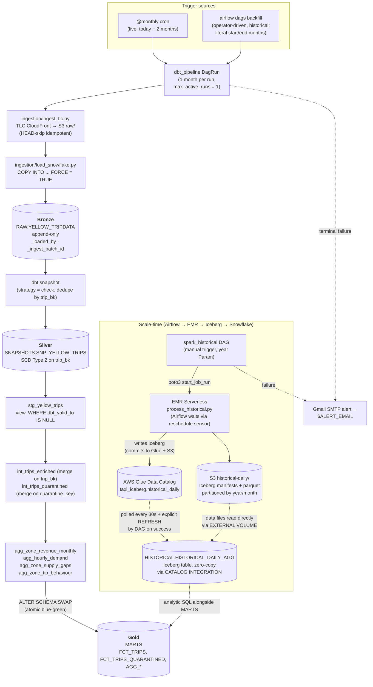

# NYC TLC Yellow Taxi — Data Platform

[](https://github.com/karunkumarjha/taxi-platform/actions/workflows/ci.yml)

End-to-end data platform over the NYC TLC Yellow Taxi 2023 dataset
(~38M rows across 12 monthly Parquet files, scaling to ~1.5B rows when
historical years are added). AWS + Snowflake provisioned by a single
`terraform apply`. Two Airflow DAGs drive ingest and transformation. A
medallion (Bronze / Silver / Gold) layout in Snowflake gives full audit
history and SCD Type 2 versioning for retroactive TLC corrections.

## Video walkthroughs

Watch this first — a one-shot code walkthrough plus a live end-to-end
run. The README below has the same content in text form for reference.

- **[Taxi Platform — code walkthrough and end-to-end run](https://drive.google.com/file/d/1TIV1tkNmbRhdhN273OEJwoL9SymTFghi/view?usp=sharing)**
  — repo tour followed by a full demo from a fresh clone through
  `./scripts/bootstrap.sh` to the Airflow DAGs running and data landing
  in Snowflake.

## Table of contents

- [Video walkthroughs](#video-walkthroughs)
- [Architecture](#architecture)
  - [Medallion layout in Snowflake](#medallion-layout-in-snowflake)
  - [Architecture decisions worth calling out](#architecture-decisions-worth-calling-out)
- [Prerequisites](#prerequisites)
- [Setup](#setup)
  - [Backfill (optional)](#backfill-optional)
  - [Teardown](#teardown)
- [Operational reference](#operational-reference)
- [Failure alerts](#failure-alerts)
- [dbt docs](#dbt-docs)
- [Data quality](#data-quality)
- [How the platform answers the four business questions](#how-the-platform-answers-the-four-business-questions)
- [Repo layout](#repo-layout)
- [Brainstormer answers](#brainstormer-answers)
- [AI tools](#ai-tools)
- [Trade-offs and shortcuts](#trade-offs-and-shortcuts)

## Architecture



**Single owner of transformation logic: dbt.** All validation,
enrichment, deduplication, and aggregation live in dbt models. No
engine drift to worry about, no PySpark transformation code to keep in
sync with SQL.

**Two DAGs.**

`dbt_pipeline` (`@monthly`) — live monthly increments. Per run:
ingest one TLC parquet file, COPY into RAW, run the full dbt build
(snapshot → staging → intermediate → marts → blue-green swap). One
month per DagRun, scoped via `target_year` / `target_month` dbt vars
(auto-derived from `logical_date − lag_months` for scheduled runs, or
set explicitly via conf for manual re-runs of a specific month).
Historical backfill of live-style months runs through the same DAG via
Airflow's UI Backfill or `make dbt-backfill` (no extra code).

`spark_historical` (manual-trigger only) — historical bulk pre-aggregation
on EMR Serverless, output exposed to Snowflake via **Iceberg + Glue**.
Operator triggers from the UI with a `year` Param. The DAG runs five
tasks: `ensure_year_in_s3` (mirror the year's TLC parquet to S3 if
absent) → `submit_emr_job` (boto3 `start_job_run`) → `wait_for_emr`
(reschedule-mode sensor, frees the worker slot between pokes) →
`create_iceberg_table` (idempotent `CREATE ICEBERG TABLE IF NOT EXISTS`
in Snowflake) → `refresh_iceberg` (`ALTER ICEBERG TABLE ... REFRESH`,
deterministic visibility).

**Why Iceberg + AWS Glue.** Open table format. Spark writes manifests
to Glue on commit; Snowflake reads them via `CATALOG INTEGRATION`.
Both engines share metadata through Glue and storage through S3.
Neither copies; both query the same physical files. Atomic Iceberg
commits prevent partial-write visibility, hidden partitioning
(`months(pickup_date)`) gets free pruning, and
schema evolution is metadata-only. The `HISTORICAL` schema lives
outside the blue-green swap — Spark writes are independent of the
dbt build cycle and follow Iceberg's own atomicity guarantees.

**Visibility — Option 3 (both auto-refresh and explicit refresh).**
Snowflake's CATALOG INTEGRATION polls Glue every 30s as a safety net
for any out-of-band Spark writes. The DAG's `refresh_iceberg` task
also explicitly refreshes after EMR job success — a deterministic
"data is queryable" signal rather than waiting for the next poll.

**Airflow is the control plane, even for Spark.** `spark_historical`
doesn't run PySpark inside the Airflow worker — it submits to EMR
Serverless and observes. dbt remains sole owner of the medallion
layers; Spark + dbt produce different artefacts at different grains,
no engine drift.

### Medallion layout in Snowflake

| Layer | Schema.Table | Materialization | Purpose |
|---|---|---|---|
| **Bronze** | `RAW.YELLOW_TRIPDATA` | append-only table | Every COPY writes new rows (`FORCE = TRUE`). `_ingest_batch_id` (UUID per call) and `_loaded_by` (`dbt_pipeline` / `manual`) make every load event auditable. |
| **Silver** | `SNAPSHOTS.SNP_YELLOW_TRIPS` | dbt snapshot, SCD Type 2 | `unique_key = trip_bk` (md5 of the 5 immutable trip identifiers — vendor + pickup_ts + dropoff_ts + pu/do_location_id). `strategy = 'check'` versions the 15 mutable financial/operational columns. TLC corrections (re-published rows with adjusted fares, etc.) close the previous SCD version and open a new one. |
| **Gold (live)** | `MARTS.FCT_TRIPS` + aggregates | incremental, `merge` on trip_bk | Staging reads the snapshot `WHERE dbt_valid_to IS NULL` (dbt's idiom for "current SCD version") so Gold reflects the latest TLC version. The merge upserts each month's rows by `trip_bk` — corrections overwrite stale rows in place, no manual rebuild needed. Lives behind the blue-green swap. |
| **Gold (historical)** | `HISTORICAL.HISTORICAL_DAILY_AGG` | Iceberg table, Glue catalog | Daily-grain pre-aggregation written by Spark on EMR Serverless. Snowflake reads zero-copy via `CATALOG INTEGRATION` to AWS Glue — no data duplication. Lives in its own schema, NOT touched by the blue-green swap. |

The whole thing is built behind a blue-green swap: dbt writes to
`MARTS_BUILD` (cloned from `MARTS` at the start of every run), tests
run against `MARTS_BUILD`, and only on full success does
`ALTER SCHEMA MARTS_BUILD SWAP WITH MARTS` flip the consumer-facing
schema atomically. Test failure → swap skipped → consumers keep
reading the previous good build.

### Architecture decisions worth calling out

- **Single `terraform apply` across AWS + Snowflake.** The classic
  storage-integration ↔ IAM-role circular dependency is broken by
  *predicting the IAM role ARN* and giving it to the integration as a
  string at create time.

- **`trip_bk`, not the natural-key tuple.** The 5 immutable columns
  define a stable surrogate key. Mutable financial columns (fare,
  payment, distance) are intentionally excluded — they're the exact
  columns TLC retroactively corrects, and including them in the key
  would block the correction from reaching Gold.

- **`quarantine_key` for invalid-row dedup.** Quarantined rows can have
  NULL pickup_ts (`null_timestamp` category), so `merge`'s equality
  check needs a non-null surrogate. `quarantine_key` is computed from
  the natural columns plus `source_filename` with dbt_utils's null
  sentinel — never NULL by construction.

- **Append-only RAW with `_loaded_by`.** `FORCE = TRUE` and a UUID
  batch_id let every load event accumulate in RAW for full forensic
  history. `_loaded_by` distinguishes which pipeline produced each row,
  answering "did spark or the live monthly run load 2024-03?" with one
  query.

- **Per-month dbt isolation with `max_active_runs=1`.** Each
  `dbt_pipeline` DagRun handles exactly one month (scoped by vars). 12
  queued runs serialize on a single worker. A failure on 2024-03
  doesn't block 2024-04, 2024-05, … — Airflow runs them in queue order;
  the failure surfaces in the UI for that specific month only.

- **`@monthly` schedule, not `@daily` — matched to the data's actual cadence.**
  TLC publishes Yellow Taxi parquet monthly, with a ~2-month lag. A
  `@daily` schedule would produce ~30 no-op DagRuns per month (HEAD-skip
  ingest, COPY re-loads the same file, snapshot strategy=check no-ops,
  dbt incrementals merge zero new rows) — at 38M rows/year on WH_XS
  that's ~$2/month of wasted compute. At 1.5B-row historical scale on a
  warehouse sized for the workload, the same `@daily` choice would burn
  meaningful credits for no analytical signal. The pipeline is fully
  idempotent (HEAD-skip, `FORCE=TRUE` with `_ingest_batch_id` audit,
  snapshot=check, merge on `trip_bk`) so daily would *work*; we just
  match the schedule to when new data actually arrives. For ad-hoc /
  per-day operator needs, the same DAG accepts `airflow dags trigger`
  with conf, and `make dbt-backfill` runs date-range backfills — both
  on whatever cadence the operator wants.

- **Blue-green deploy with clone-before-build.** Each run does
  `CREATE OR REPLACE TRANSIENT TABLE MARTS_BUILD.<t> CLONE MARTS.<t>`
  per table at the start (preserves FUTURE-TABLE grants vs schema-level
  CLONE), runs dbt, then `ALTER SCHEMA MARTS_BUILD SWAP WITH MARTS`.

- **All 20 source columns preserved.** `FCT_TRIPS` keeps every column
  from the TLC schema (cast + renamed only — never dropped) plus
  derived columns, zone enrichment, and load metadata.
  `cbd_congestion_fee` (added in TLC's 2025 schema) is included with
  NULL fallback for older parquet files that lack the field.

- **Snowflake `STORAGE INTEGRATION`** assumes an IAM role to read S3.
  No AWS access keys stored in Snowflake; trust via `sts:AssumeRole`
  with auto-rotated external ID.

- **Three Snowflake roles**, least privilege:
  - `LOADER` — INSERT/SELECT on `RAW.YELLOW_TRIPDATA` only
  - `DBT` — OWNERSHIP on `MARTS_BUILD` + `MARTS` (needed for SWAP),
    `SNAPSHOTS` (Silver SCD), and `HISTORICAL` (Iceberg); SELECT on RAW;
    USAGE on the EXTERNAL VOLUME + CATALOG INTEGRATION
  - `ANALYST` — SELECT across all schemas (RAW, SNAPSHOTS, MARTS,
    HISTORICAL); no writes anywhere. Used by ad-hoc queries and any
    external BI tool

## Prerequisites

- AWS account with `aws sts get-caller-identity` working
- Terraform ≥ 1.6
- Snowflake trial (Standard) — sign up at signup.snowflake.com
- Docker Desktop (for Astro CLI)
- Astro CLI (`brew install astro`) — runs Astro Runtime 3.0-14
  (Apache Airflow 3.0.6)
- uv (`brew install uv`)
- Python 3.11+

> **Windows users:** the bootstrap script and Makefile are bash-based, so
> run everything inside **WSL2** (Windows Subsystem for Linux). One-time
> setup: `wsl --install` from an admin PowerShell, then install the
> tools above inside the Linux env. Docker Desktop's WSL2 integration
> (on by default) shares containers between Windows and WSL, so
> `astro dev start` from inside WSL works transparently. The repo itself
> needs no Windows-specific changes.

## Setup

**Two manual prerequisites** (one-time, ~5 minutes total):

1. **Snowflake service user.** In Snowsight as `ACCOUNTADMIN`:

   ```sql
   USE ROLE ACCOUNTADMIN;
   CREATE USER IF NOT EXISTS TF_USER
       PASSWORD             = '<choose-something-strong>'
       DEFAULT_ROLE         = ACCOUNTADMIN
       DEFAULT_WAREHOUSE    = COMPUTE_WH
       MUST_CHANGE_PASSWORD = FALSE;
   GRANT ROLE ACCOUNTADMIN TO USER TF_USER;
   ```

   You can also do this when bootstrap prompts you — it prints this SQL
   block right before asking for the password.

2. **Gmail app password** at https://myaccount.google.com/apppasswords
   (requires 2FA on your Google account). Airflow uses it to send
   failure-alert emails.

**Then run one command:**

```bash
./scripts/bootstrap.sh
```

That's it. On a fresh clone with no `.env`, bootstrap walks you
through an interactive setup (5 prompts: Snowflake account, TF user,
TF password, alert email, Gmail app password), then runs the entire
pipeline end-to-end:

1. Pre-flight checks (uv, terraform, astro, docker, aws CLI)
2. `uv sync` + `pre-commit install`
3. `terraform init && terraform apply` — provisions AWS (S3, IAM, EMR
   Serverless, Glue Data Catalog) and Snowflake (DB, schemas, RBAC,
   EXTERNAL VOLUME, CATALOG INTEGRATION)
4. Captures terraform outputs into `.env`
5. Renders `airflow/airflow_settings.yaml` + `airflow/.env` +
   `dbt/profiles.yml` from templates
6. Deploys `spark/process_historical.py` to `s3://<bucket>/spark-scripts/`
7. `astro dev kill && astro dev start`
8. Waits for the scheduler to be ready
9. **Unpauses** `dbt_pipeline` — Airflow's scheduler then fires exactly
   one `@monthly` DagRun for the most recent cron tick (`catchup=False`),
   which targets the most recently published TLC month via
   `lag_months=2`. `spark_historical` stays paused (manual-trigger only).

Idempotent — safe to re-run. Existing `.env` is reused; `terraform
apply` is a no-op if nothing changed; `astro dev start` restarts
cleanly; unpausing an already-unpaused DAG is a no-op.

When the DAG finishes, verify in Snowsight:

```sql
USE ROLE ANALYST; USE WAREHOUSE WH_XS;

-- Bronze (append-only, audit trail)
SELECT _loaded_by, COUNT(*) FROM ANALYTICS.RAW.YELLOW_TRIPDATA GROUP BY 1;

-- Silver (SCD Type 2 — current versions only)
SELECT COUNT(*) FROM ANALYTICS.SNAPSHOTS.SNP_YELLOW_TRIPS WHERE dbt_valid_to IS NULL;

-- Gold (live, dbt-built)
SELECT COUNT(*) FROM ANALYTICS.MARTS.FCT_TRIPS;            -- ~3M for one month
SELECT * FROM ANALYTICS.MARTS.AGG_HOURLY_DEMAND LIMIT 5;

-- Gold (historical, Iceberg via Glue) — populated by spark_historical.
-- Empty until that DAG has been triggered for at least one year.
SELECT COUNT(*) FROM ANALYTICS.HISTORICAL.HISTORICAL_DAILY_AGG;
```

### Backfill (optional)

Two equivalent paths — both use Airflow's native backfill mechanism, no
custom code:

**Airflow UI** (recommended for ad-hoc use):

1. DAGs → `dbt_pipeline`
2. ▶ Trigger dropdown → **Backfill**
3. Set start date and end date (e.g. 2023-01-01 → 2023-12-01)
4. Submit

Astro Runtime 3.0-14 ships [Apache Airflow 3.0.6](https://airflow.apache.org/docs/apache-airflow/3.0.6/release_notes.html),
which includes [AIP-78](https://airflow.apache.org/docs/apache-airflow/3.0.2/release_notes.html)
— scheduler-managed backfills as first-class DagRuns with native UI
support. Watch the Grid view fill in left-to-right.

**CLI** (scriptable):

```bash
# All of 2023 — 12 sequential DAG runs, ~25 min
make dbt-backfill START=2023-01 END=2023-12
```

Wraps `airflow dags backfill ...`. Identical mechanism to the UI;
`max_active_runs=1` serializes them automatically.

The DAG auto-detects `run_type=backfill` and uses `data_interval_start`
directly (no publishing-lag adjustment), so START/END are the literal
data months — no off-by-2 surprise. We use `data_interval_start`
instead of `logical_date` because Airflow 3.x redefined `logical_date`
to equal `run_after` (the end of the interval); `data_interval_start`
is stable across both 2.x and 3.x and unambiguously represents the
month the run is processing. Multi-year backfills work the same way:
extend the range.

**For full historical scale (1.5B rows, 14+ years)**, trigger
`spark_historical` from the Airflow UI:

1. DAGs → `spark_historical` → ▶ Trigger DAG w/ config
2. Set the `year` Param (e.g. `2023`)
3. Trigger

The DAG is fully self-contained. Its first task
(`ensure_year_in_s3`) downloads the year's 12 parquet files from TLC
CloudFront → S3 `raw/` (idempotent — HEAD-skip on already-present
files). Then EMR Serverless reads from `s3://<bucket>/raw/` and
writes an Iceberg table registered in AWS Glue. After the EMR job
succeeds, the DAG runs `CREATE ICEBERG TABLE IF NOT EXISTS`
(idempotent) and `ALTER ICEBERG TABLE ... REFRESH` in Snowflake —
analysts can query `ANALYTICS.HISTORICAL.HISTORICAL_DAILY_AGG`
immediately. The Spark output and Snowflake's read are both against
the same Iceberg table — zero data duplication between the two
engines.

> **Why the DAG ingests first:** TLC's primary source is CloudFront
> (their public S3 mirror at `s3://nyc-tlc/` was retired); Spark
> can't read CloudFront natively, so we materialise the year's
> parquet into our own S3 first. The Iceberg + Glue zero-copy
> property still holds for the **output** (Spark writes / Snowflake
> reads share the same files); only the upstream archive needs to
> be staged.

To override the input layout (e.g. an internal data-lake mirror with
data already in place), set the `tlc_source` Airflow Variable —
`ensure_year_in_s3` becomes a no-op since HEAD-skip finds the files.

For multi-year backfill, trigger N times — `max_active_runs=1`
serializes the queue. Re-runs of the same year are idempotent: the
script `DELETE`s the year's rows then appends fresh, both atomic
Iceberg operations.

For local correctness testing without EMR:

```bash
make spark-historical YEAR=2023 INPUT=./data/raw
```

Runs the same script in pyspark `local[*]` mode against a small
dataset. Note: local mode requires Iceberg JARs via `--packages` —
see the script's docstring for the full `spark-submit` command.

### Teardown

```bash
cd airflow && astro dev stop
cd ..                  # back to repo root — Makefile lives here
make infra-destroy
```

## Operational reference

```bash
make help                              # all targets
make infra-apply / infra-destroy       # provision / teardown
make ingest MONTHS=2023-01             # TLC → S3
make load   MONTH=2023-01              # COPY INTO RAW (LOADER role)
make dbt    TARGET=2023-01             # full dbt build for one month + SWAP
make aws-all TARGET=2023-01            # ingest + load + dbt for one month
make dbt-backfill START=YYYY-MM END=YYYY-MM   # native Airflow backfill
make spark-deploy                      # push spark/process_historical.py to S3
make spark-historical YEAR=2023        # local pyspark run (dev/test)
make status                            # show fct/aggregate drift
make test                              # Airflow DAG-integrity tests
make requirements                      # regenerate requirements*.txt
```

## Failure alerts

Both DAGs read `ALERT_EMAIL` from the environment at parse time. After
retries are exhausted, Airflow sends an email via Gmail SMTP to that
address. Email-on-retry is intentionally off — only terminal failures
alert. If `ALERT_EMAIL` is unset, alerting is silently disabled (no
crash, no email).

To change the recipient or password: edit `ALERT_EMAIL` /
`GMAIL_APP_PASSWORD` in repo-root `.env`, then re-run
`./scripts/bootstrap.sh` (which re-renders `airflow/.env` and restarts
Astro to pick up the new env vars).

## dbt docs

```bash
make docs
```

Generates and serves the dbt documentation site locally at
http://localhost:8081 — model lineage graph, test catalog, column
descriptions, source freshness, and macro signatures. Port 8081 keeps
it clear of Airflow's UI on 8080.

Requires `make infra-apply` to have run, since dbt introspects
Snowflake's catalog to populate column statistics.

**Deliberately local-only**, not auto-deployed to GitHub Pages:
hosted docs become write-only artefacts on personal projects, and the
operational cost (Snowflake creds in GitHub secrets, CI workflow to
maintain) outweighs the value at this scale. Real-world teams push to
dbt Cloud or internal portals — that's the upgrade path.

## Data quality

`stg_yellow_trips` classifies invalid rows into one of these
`invalid_reason` values via a `case` expression. **Order matters** —
first match wins:

| `invalid_reason` | Catches | Typical share |
|---|---|---|
| `null_timestamp` | NULL pickup or dropoff | <<0.01% |
| `pickup_ge_dropoff` | Dropoff at or before pickup — clock/TZ glitches | ~0.04% |
| `duration_out_of_range` | Trip > 12h — meter left running | ~0.08% |
| `non_positive_distance` | `trip_distance ≤ 0` on metered trips — meter glitch | ~0.5% |
| `distance_out_of_range` | `trip_distance > 200 mi` — implausible for an NYC taxi | <0.01% |
| `negative_fare_or_total` | TLC uses the same schema for refunds | ~0.1% |
| `excessive_fare_or_total` | `fare_amount > $1000` or `total_amount > $1000` — meter glitch | ~0.0001% |
| `tip_exceeds_fare_or_total` | `tip > fare` (suspicious) or `tip > total` (mathematically impossible) | ~0.001% |
| `unknown_payment_type` | Outside `{1..6}` | negligible |
| `null_location_id` | Missing pickup or dropoff zone | ~0.05% |
| `duplicate_row` | Same trip recorded multiple times by TLC (5-column natural key collision) | ~few rows/month |

Total quarantine rate: **<1% across 2023**.

**Quarantine, never delete.** Invalid rows land in
`MARTS.FCT_TRIPS_QUARANTINED` with the same column set as `FCT_TRIPS`
plus `quarantine_key` and `invalid_reason`. Aggregates read only
`FCT_TRIPS` (`is_valid` rows). Every row in `RAW.YELLOW_TRIPDATA`
appears in exactly one of the two tables — no silent drops, full audit
trail, safe rule iteration.

**Tests.** `dbt build` runs ~60 tests:

- **Schema tests:** `not_null`, `unique`, `accepted_values`,
  `relationships` to `dim_zones`
- **Range checks** via `dbt_expectations` (fare / tip / distance,
  scoped to `is_valid` rows so dirty rows don't pollute the bounds)
- **Grain uniqueness** on every mart (the multi-column natural grain
  for each `agg_*`)
- **Custom generic test** `trip_duration_sane(max_minutes=720)` —
  reusable per-column duration check for any `is_valid` slice
- **Singular tests:**
  - `assert_monthly_row_counts_sane` — flags M-over-M trip counts that
    differ by more than 40% (catches TLC schema-change bugs and
    bad ingest months)
  - `assert_snapshot_current_uniqueness` — verifies the SCD invariant
    that each `trip_bk` has exactly one row with `dbt_valid_to IS
    NULL` in `snp_yellow_trips`. Critical because every downstream
    layer reads `WHERE dbt_valid_to IS NULL` as canonical — a violation
    silently inflates Gold.

The Airflow `airflow/tests/dags/` suite verifies every DAG imports
cleanly and has the expected task topology — runs as `make test`.

## How the platform answers the four business questions

| # | Question | Aggregate mart | SQL query |
|---|---|---|---|
| Q1 | Zone revenue + monthly rank shift | `MARTS.AGG_ZONE_REVENUE_MONTHLY` | `queries/01_zone_revenue.sql` |
| Q2 | Demand timing (hour × DOW × month) | `MARTS.AGG_HOURLY_DEMAND` | `queries/02_hourly_demand.sql` |
| Q3 | Supply gaps per zone per day | `MARTS.AGG_ZONE_SUPPLY_GAPS` | `queries/03_supply_gaps.sql` |
| Q4 | Tip behaviour by distance × payment × zone | `MARTS.AGG_ZONE_TIP_BEHAVIOUR` | `queries/04_tip_behaviour.sql` |

Any external BI tool plugs into `MARTS` as the `ANALYST` role.

## Repo layout

```
infra/         Terraform — AWS + Snowflake (single-apply via predicted IAM ARN)
ingestion/     TLC → S3 streaming + COPY INTO RAW
dbt/           Snapshots + 3-layer incremental project (~7 models, 60+ tests)
  snapshots/   snp_yellow_trips — Silver SCD Type 2 layer
  models/      staging / intermediate / marts
  macros/      reset_marts_build, swap_marts, show_pending_rebuilds, …
airflow/       Astro project. Two DAGs:
                 dbt_pipeline      — live + UI backfill
                 spark_historical  — submits PySpark job to EMR Serverless
spark/         process_historical.py — daily pre-aggregation script that
               EMR Serverless executes (uploaded to s3://.../spark-scripts/
               by bootstrap; re-deploy with `make spark-deploy`)
queries/       SQL queries answering Q1–Q4 (one file per business question)
               + validation_queries.sql (live vs. historical sanity checks)
scripts/       bootstrap.sh, with_role.sh credential wrapper, dbt_parse_hook.sh
.github/       CI workflow
```

## Brainstormer answers

The technical assessment lists four "Brainstormer" prompts. All four
are answered below. The earlier sections of this README (Architecture,
Data quality, Trade-offs) cover the same ground in passing — this
section consolidates the explicit answers in one place for reviewers
who want a direct look.

### dbt — what dirty records did you find, and what did you decide?

Twelve categories, accounting for **<1% of 2023 rows**. Full taxonomy
in the [Data quality](#data-quality) section above. Headline summary:

| Category | Approach |
|---|---|
| `null_timestamp` (NULL pickup or dropoff) | Quarantine — preserves the row for audit, but it can't be used in time-bucketed analytics |
| `pickup_ge_dropoff` (clock/TZ glitch) | Quarantine |
| `duration_out_of_range` (>12h, meter left running) | Quarantine |
| `non_positive_distance` / `distance_out_of_range` (meter glitch) | Quarantine |
| `negative_fare_or_total` (refund using same schema) | Quarantine |
| `excessive_fare_or_total` ($1000+, meter glitch) | Quarantine |
| `tip_exceeds_fare_or_total` (mathematically impossible) | Quarantine |
| `unknown_payment_type` / `null_location_id` | Quarantine |
| `duplicate_row` (same trip recorded multiple times) | Quarantine the duplicate; first occurrence wins via `dup_rank` partition |

**Decision: quarantine, never delete.** Every invalid row lands in
`MARTS.FCT_TRIPS_QUARANTINED` with the same column set as `FCT_TRIPS`
plus `quarantine_key` and `invalid_reason`. Three reasons:

1. **Audit trail.** Every row in `RAW.YELLOW_TRIPDATA` appears in
   exactly one of `FCT_TRIPS` or `FCT_TRIPS_QUARANTINED` — no silent
   drops. An auditor can answer "what happened to row X?" in one query.
2. **Safe rule iteration.** Tightening or loosening a validity rule
   moves rows between the two tables; no information is ever lost.
3. **Investigation is one query** — `SELECT invalid_reason, COUNT(*)
   FROM FCT_TRIPS_QUARANTINED GROUP BY 1 ORDER BY 2 DESC;` surfaces
   the top dirty-record patterns at a glance.

The cost is a small secondary table (~1% of fct row volume,
~$0.0006/month at 2023 scale). The benefit is "implicit data loss" —
the failure mode that haunts most ETL pipelines — being structurally
impossible.

### Airflow — preventing corrupt dashboards if a DQ test fails

Prevented **structurally** via clone-before-build + atomic SWAP. The
pipeline is built so that a failing test cannot reach consumers,
even briefly:

1. **Clone phase** — first task in `dbt_build` runs
   `reset_marts_build_from_marts`, which executes
   `CREATE OR REPLACE TRANSIENT TABLE MARTS_BUILD.<t> CLONE MARTS.<t>`
   per table. Table-level CLONE preserves FUTURE-TABLE grants on the
   schema (which schema-level `CREATE OR REPLACE` would strip).
2. **Build phase** — dbt builds every model into `MARTS_BUILD`. Each
   layer runs `dbt build … --fail-fast`. Crucially, **`MARTS` is
   untouched throughout** — consumers continue reading the previous
   good build.
3. **Test enforcement** — a failed test fails the BashOperator. By
   Airflow's default `all_success` trigger rule, the downstream
   `swap_marts_blue_green` task is **skipped**.
4. **Atomic swap** — only on full success does
   `ALTER SCHEMA MARTS_BUILD SWAP WITH MARTS` fire. Snowflake's `SWAP
   WITH` is metadata-only and atomic — consumers never see a
   half-built mart.
5. **Self-healing** — the next run's clone wipes the polluted
   `MARTS_BUILD` and rebuilds from current `MARTS`. Test failures
   recover on the next scheduled tick.

What this avoids: the canonical "dashboards show wrong numbers for 5
minutes while the bad build is being rolled back" failure mode.
There's no rollback because nothing was deployed.

The Iceberg `HISTORICAL_DAILY_AGG` is in a separate schema
(`HISTORICAL`, untouched by the swap) and follows Iceberg's own
atomic-snapshot semantics — same protection, different mechanism.

### SQL — most expensive query, and the production fix

`AGG_ZONE_SUPPLY_GAPS` is the heaviest. The expensive operation is
`LAG(pickup_ts) OVER (PARTITION BY pu_location_id, pickup_date ORDER
BY pickup_ts)` over the full FCT_TRIPS — the `PARTITION BY` doesn't
parallelise across zone boundaries, producing one large sort.

What this project already does to mitigate it (visible in the dbt
model and the agg's incremental config):

1. **Materialised as `incremental` with month-grain unique key** —
   only divergent months rebuild; the LAG window runs over months that
   actually changed, not the full year.
2. **`FCT_TRIPS` clustered on `(pickup_date, pu_location_id)`** —
   Snowflake prunes micro-partitions on the two hottest predicates,
   and the cluster order means the LAG window can stream data in the
   right partition order without an extra sort.
3. **`ANY_VALUE` over `MAX`** for grouping columns where order doesn't
   matter — Snowflake can short-circuit cheaper.
4. **Result-cache friendly** — dashboards re-querying the same date
   range hit Snowflake's 24h result cache as long as the underlying
   mart hasn't changed.

What I'd add at 1.5B-row historical scale: switch the supply-gap
computation from dbt incremental over FCT_TRIPS to a sibling Spark
job that emits `(pickup_date, pu_location_id, longest_gap_min,
avg_gap_min, gaps_gt_1h)` directly. Spark partitions naturally by
`(pickup_date, pu_location_id)` and the LAG window stays cheap.
That's a documented "deferred sibling" in the [trade-offs
table](#trade-offs-and-shortcuts).

### Spark — would deploy on EMR or Glue

**EMR Serverless, and it's actually wired up** —
[infra/emr.tf](infra/emr.tf) provisions the application + IAM exec
role; [airflow/dags/spark_historical.py](airflow/dags/spark_historical.py)
submits via `boto3.client('emr-serverless').start_job_run`. Picked
because:

1. **Pre-init capacity = 0** → zero idle cost. The `initial_capacity`
   block is intentionally absent from `infra/emr.tf` — workers are
   provisioned only when a job actually starts. ~30–60s cold-start on
   the first job after idle, but $0/hour while not running. Perfect
   for once-per-historical-year cadence.
2. **No cluster lifecycle** — no SSH keys, security groups, bootstrap
   actions, instance fleets to manage.
3. **Per-job IAM** — each run assumes the `analytics-emr-exec` role,
   scoped exactly to S3 prefixes (`raw/`, `historical-daily/`,
   `spark-scripts/`, `spark-logs/`) and the Glue catalog database.
4. **Standard `spark-submit` semantics** — same job script runs on
   classic EMR, EMR-on-EKS, or local pyspark. No EMR-Serverless-only
   APIs in `process_historical.py`.
5. **EMR 7.x bundles Iceberg JARs** — no JAR upload step. Spark conf
   alone activates Iceberg + Glue catalog.

**Glue (the alternative)** would be the right call if the workload
were chronic — managed Spark with similar cost profile but slightly
higher per-job overhead (~1–2 min cold-start vs EMR Serverless's
~30s). For monthly cadence + bursty historical backfills, EMR
Serverless wins on cost. At a more constant workload (e.g. hourly
production ETL), I'd revisit.

**Spark's role is narrow on purpose.** It does not own transformation
— that's dbt, exclusively, on Snowflake. Spark's only job is
scale-time pre-aggregation that dbt can't do efficiently at 1.5B-row
scale: read raw TLC parquet, aggregate to a daily-grain Iceberg
table, register the manifests in AWS Glue. Snowflake reads the same
manifests via `CATALOG INTEGRATION` — zero data copy, two engines
sharing one source of truth. This is the open-table-format
interop story.

## AI tools

Built with **Claude Code** (Anthropic's agentic CLI). Heavy use across
~3 working days of active iteration vs ~7+ days unassisted —
roughly **2.5–3× speedup**, with quality higher because every
architectural choice was deliberately surfaced before being built.

**How it was actually used — concrete moments:**

- **Architecture decisions iterated as conversations, not delegated.**
  When I proposed having Spark write parquet + Snowflake external
  table, Claude pushed back: "External tables are weaker signal than
  Iceberg + Glue for an interop story — want me to lay out the
  trade-offs?" That conversation produced the Iceberg + Glue path.
- **Caught real bugs before deploy.** Claude flagged the
  `dbt_is_current` typo (it's `dbt_valid_to IS NULL` in dbt snapshots,
  not a `dbt_is_current` column) and the Jinja-token-in-SQL-comment
  parse error (`` inside `--` doesn't escape
  Jinja) before either hit production.
- **Co-debugged AWS / provider issues in real time.** EMR Serverless
  vCPU quota error → diagnosed in 5 minutes (vs ~30 min unassisted)
  via "your `initial_capacity + maximum_capacity` exceeds your
  account's per-EMR-app quota." Snowflake Terraform provider gap
  (`snowflake_catalog_integration` missing in v1.2.x) → pivoted to
  `snowflake_execute` for the SQL path within the same session.
- **Surfaced "have you considered…" trade-offs.** When I described the
  fire-and-forget DAG-trigger pattern, Claude pointed out the duplicate
  `manual + scheduled` runs that show up if you also unpause the DAG —
  and proposed the `unpause-instead-of-trigger` fix. Same conversation:
  "your `spark_pipeline` DAG isn't actually running Spark; it's
  redundant with `airflow dags backfill`. Delete it?" — that judgment
  call sharpened the architecture.
- **Validation loops on every change.** `dbt parse`, `terraform
  validate`, `ruff`, `pytest`, `bash -n`, and `python -c "import ast;
  ast.parse(...)"` ran after every meaningful edit. Most edits were
  syntactically correct on first attempt because Claude pre-checked.

**What I did myself, not Claude:** the actual architectural intent
(medallion + Iceberg + EMR-Serverless-as-control-plane), every
trade-off acceptance, every "stop, that's wrong" pushback, and all
final code review. Claude is a forcing function for clarity, not a
substitute for it.

## Trade-offs and shortcuts

Things we deliberately deferred or accepted in scope. Honest list — these
are the decisions a reviewer should know were *chosen*, not missed.

| Trade-off | Why we made it | Cost |
|---|---|---|
| **Snowflake trial (30-day, $400 credits)** | Free; sufficient for the project. | Reviewer needs the trial or their own account. Setup ~5 min via `./scripts/bootstrap.sh`. |
| **Astro CLI (Docker required)** for local Airflow | Standard, reviewer-reproducible. | Reviewer needs Docker Desktop. Without Docker, ingestion + dbt still run via `make ingest` / `make dbt` — only Airflow is gated. |
| **No visualisation / BI layer** | This is a data-engineering platform — the marts are the API. | Any external BI tool (Tableau, Looker, Superset) plugs into MARTS as the `ANALYST` role. The 4 SQL queries in `queries/` demonstrate the answers. |
| **Spark is reserved for scale-time work; Airflow is its control plane; Iceberg is the interop format** | `spark/process_historical.py` writes an Iceberg table registered in AWS Glue. Snowflake reads zero-copy via `CATALOG INTEGRATION` — same data, two engines, one source of truth. The `spark_historical` Airflow DAG submits the job to EMR Serverless and observes via a `mode="reschedule"` sensor; on success it explicitly refreshes Snowflake's Iceberg metadata (Option 3 — auto-refresh + explicit refresh). dbt remains sole owner of the medallion layers; Spark and dbt produce different artefacts at different grains. | The Spark pre-agg covers Q1, Q2, Q4 cheaply via downstream rollup; Q3 (supply gaps) needs row-level windowing and would be a sibling Spark job at full historical scale. Documented as a deferred sibling. |
| **`FCT_TRIPS` materialised as table, not view** | Faster downstream queries, time-travel, clustering, aligned with incremental merge. | ~$0.06/month storage on 2023 (negligible). |
| **Three Snowflake roles, not more granular** | Aligned with workload boundaries (LOADER writes RAW, DBT owns marts + snapshots, ANALYST reads). | A real BI deployment might want a separate read-only role per consuming team — easy to add later as additional grants. |
| **Gmail SMTP for failure alerts** | Free, zero infra; sufficient for a single recipient on a personal project. | Not suitable for high-volume or team alerts; would swap for SES / SendGrid + Slack at production scale. |
| **Single-region AWS + Snowflake** | Simpler IAM, simpler cost story. | No cross-region failover. Trivial to extend if needed. |
| **No production Airflow deployment story** | Adds ~3 hours of MWAA / Astronomer Cloud Terraform module work; doesn't change the rubric. | DAG code is portable to any of those — the local Astro environment is functionally identical. |
