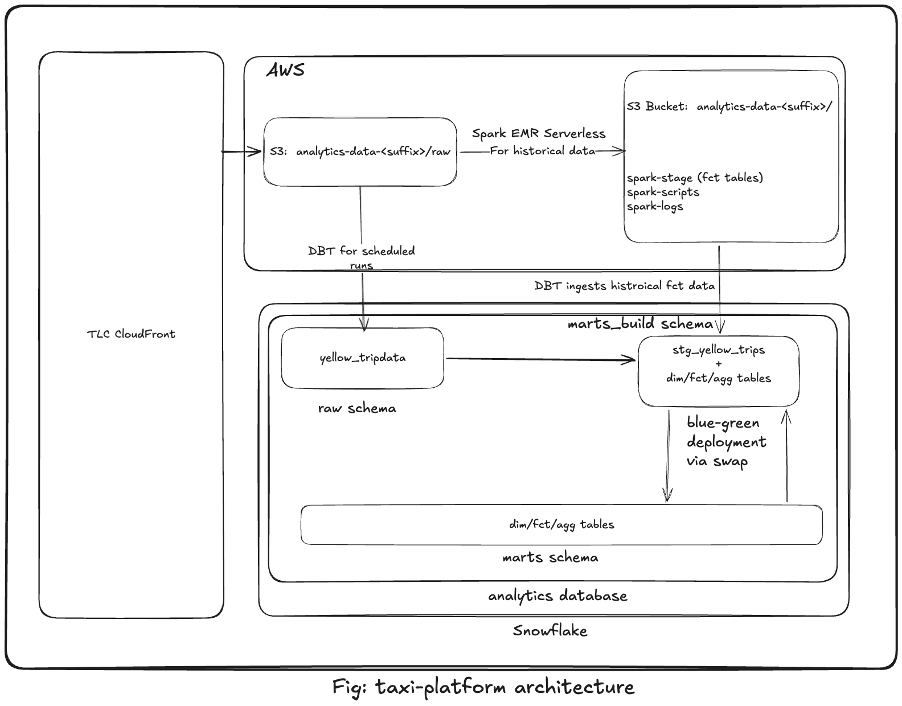

# NYC TLC Yellow Taxi — Data Platform

[](https://github.com/karunkumarjha/taxi-platform/actions/workflows/ci.yml)

End-to-end data platform over the NYC TLC Yellow Taxi 2023 dataset
(~38M rows across 12 monthly Parquet files, scaling to ~1.5B rows when
historical years are added). AWS + Snowflake provisioned by a single
`terraform apply`. Two Airflow DAGs drive ingestion, transformation, and
historical Spark backfill — the dbt pipeline is the only writer to
Snowflake; Spark stages historical facts to S3 and dbt picks them up via
COPY.

## Video walkthroughs

Watch this first — a one-shot code walkthrough plus a live end-to-end
run. The README below has the same content in text form for reference.

- **[Taxi Platform — code walkthrough and end-to-end run](https://drive.google.com/file/d/12Zfs1rAaKSMdnvZLAQpozYTkVZvsr12s/view?usp=sharing)**
  — repo tour and the architectural decisions worth calling out (predicted
  IAM ARN for single-apply Terraform, self-healing dbt via count-divergence,
  natural-key dedup, clone-before-build, Spark↔S3↔dbt unification),
  followed by a full demo from a fresh clone through `./scripts/bootstrap.sh`
  to the Airflow DAGs running and data landing in Snowflake.

## Table of contents

- [Video walkthroughs](#video-walkthroughs)
- [Architecture](#architecture)
  - [Architecture decisions worth calling out](#architecture-decisions-worth-calling-out)
- [Prerequisites](#prerequisites)
- [Setup](#setup)
  - [Backfill (optional)](#backfill-optional)
  - [Teardown](#teardown)
- [Operational reference](#operational-reference)
- [Data quality](#data-quality)
  - [Twelve categories of dirty records](#twelve-categories-of-dirty-records)
  - [Quarantine, never delete](#quarantine-never-delete)
  - [Tests](#tests)
- [Brainstormer answers](#brainstormer-answers)
  - [dbt — what dirty records did you find, and what did you decide?](#dbt--what-dirty-records-did-you-find-and-what-did-you-decide)
  - [Airflow — preventing corrupt dashboards if a DQ test fails](#airflow--preventing-corrupt-dashboards-if-a-dq-test-fails)
  - [SQL — most expensive query, and the production fix](#sql--most-expensive-query-and-the-production-fix)
  - [Spark — would deploy on EMR or Glue](#spark--would-deploy-on-emr-or-glue)
- [How the platform answers the four business questions](#how-the-platform-answers-the-four-business-questions)
- [Repo layout](#repo-layout)
- [AI tools](#ai-tools)
- [Trade-offs and shortcuts](#trade-offs-and-shortcuts)

## Architecture



**Producer / consumer joined by S3.** Spark (EMR Serverless) replicates
dbt's staging logic on raw historical TLC parquet and stages
`FCT_TRIPS` / `FCT_TRIPS_QUARANTINED` parquet to S3. The `dbt_pipeline`
DAG ingests the live monthly TLC drop, COPYs any new Spark batches into
`MARTS_BUILD`, runs self-healing incremental dbt, and atomically swaps
the result into `MARTS`. Single-writer-to-Snowflake, no race conditions.

**Dual-trigger `dbt_pipeline`.** The DAG runs on
`DatasetOrTimeSchedule(@monthly, SPARK_STAGE_DATASET)` — whichever
fires first. The `@monthly` cron is the live path (ingest TLC + COPY
any pending Spark batches + dbt build + swap); every scheduled run
unconditionally calls `load_spark_staged_into_marts_build`, so Spark
batches sitting in `s3://.../staged-marts/` get picked up on the next
scheduled tick even if no one re-triggered anything. The Dataset path
fires the moment `spark_pipeline` completes (skipping the TLC ingest
since Spark already produced the data) — no waiting for the next
cron tick. Either path produces the same MARTS state; the Dataset
trigger just shortens the latency.

### Architecture decisions worth calling out

- **Single `terraform apply` across AWS + Snowflake.** The classic
  storage-integration ↔ IAM-role circular dependency is broken by
  *predicting the IAM role ARN* and giving it to the integration as a
  string at create time.
- **`spark_pipeline` → `dbt_pipeline` via Airflow Datasets.** Both DAGs
  declare the same `Dataset("spark+s3://staged-marts/fct_trips")` URI.
  `spark_pipeline`'s final task lists it as an `outlet`; `dbt_pipeline`'s
  schedule is `DatasetOrTimeSchedule(@monthly, dataset)`. Spark
  completion fires a dataset event → scheduler triggers a `dbt_pipeline`
  run that skips TLC ingest and goes straight to COPY + build + swap.
  Caveat: the consumer DAG must be unpaused to receive the event;
  events queued while paused do fire on unpause (most recent only).
- **Self-healing incremental dbt (no params).** Each model's source CTE
  compares per-(year, month) row counts against the target table.
  Months/years where counts diverge get rebuilt; matching ones are
  skipped. A row-count threshold (`var:phantom_month_threshold`, 100k)
  prevents tiny TLC cross-month tail-bleeds from creating partial-month
  aggregates. One dbt invocation absorbs live months, Spark batches, and
  late-arriving leak rows uniformly.
- **Natural-key dedup, not surrogate-key.** `FCT_TRIPS`'s `unique_key`
  is the 8-column natural tuple `(vendor_id, pickup_ts, dropoff_ts,
  pu_location_id, do_location_id, fare_amount, total_amount,
  payment_type)`. Spark and dbt compute `trip_sk` (a surrogate hash)
  independently — engine-specific cast-to-string formatting produces
  different hashes for the same physical trip. Natural keys come
  straight from source columns and are bit-identical across engines, so
  `delete+insert` dedupes correctly even when both paths process the
  same month.
- **Blue-green deploy with clone-before-build.** Each run does
  `CREATE OR REPLACE TRANSIENT TABLE MARTS_BUILD.<t> CLONE MARTS.<t>`
  per table at the start (preserves FUTURE-TABLE grants vs schema-level
  CLONE), runs dbt, then `ALTER SCHEMA MARTS_BUILD SWAP WITH MARTS`.
  Test failure → swap skipped → MARTS retains the previous good build,
  next run's clone wipes the polluted MARTS_BUILD cleanly.
- **All 20 source columns preserved.** `FCT_TRIPS` keeps every column
  from the TLC schema (cast + renamed only — never dropped) plus
  derived columns, zone enrichment, and load metadata. 36 columns
  total. `cbd_congestion_fee` (added in TLC's 2025 schema) is included
  with NULL fallback for older parquet files that lack the field.
- **Single S3 bucket, prefix-organised** with `raw/`, `staged-marts/`,
  `spark-scripts/`, `spark-logs/`. Random suffix satisfies S3's
  global-uniqueness rule.
- **Snowflake `STORAGE INTEGRATION`** assumes an IAM role to read S3.
  No AWS access keys stored in Snowflake; trust via `sts:AssumeRole`
  with auto-rotated external ID.
- **Three Snowflake roles**, least privilege:
  - `LOADER` — INSERT/SELECT on `RAW.YELLOW_TRIPDATA` only
  - `DBT` — OWNERSHIP on `MARTS_BUILD` + `MARTS` (needed for SWAP);
    SELECT on RAW; USAGE on `RAW.S3_SPARK_STAGE` for the COPY of
    Spark-staged data
  - `ANALYST` — SELECT across all schemas; no writes anywhere. Used by
    ad-hoc queries and any external BI tool

## Prerequisites

- AWS account with `aws sts get-caller-identity` working
- Terraform ≥ 1.6
- Snowflake trial (Standard) — sign up at signup.snowflake.com
- Docker Desktop (for Astro CLI)
- Astro CLI (`brew install astro`)
- uv (`brew install uv`)
- Python 3.11+

## Setup

**One manual prerequisite** (one-time per Snowflake account): create
the Terraform service user. In Snowsight as `ACCOUNTADMIN`:

```sql
USE ROLE ACCOUNTADMIN;
CREATE USER IF NOT EXISTS TF_USER
    PASSWORD             = '<choose-something-strong>'
    DEFAULT_ROLE         = ACCOUNTADMIN
    DEFAULT_WAREHOUSE    = COMPUTE_WH
    MUST_CHANGE_PASSWORD = FALSE;
GRANT ROLE ACCOUNTADMIN TO USER TF_USER;
```

Then copy `.env.example` → `.env` and fill `SNOWFLAKE_ACCOUNT` (your
account locator from Snowsight's bottom-left, `ABCD-XY12345`-style),
`SNOWFLAKE_TF_USER=TF_USER`, and the password you just set.

**Then run one command:**

```bash
./scripts/bootstrap.sh
```

This runs the entire pipeline end-to-end: pre-flight checks → `uv sync`
+ pre-commit install → `terraform init && terraform apply` → captures
outputs into `.env` → renders `airflow/airflow_settings.yaml` from
template → `astro dev kill && astro dev start` → triggers
`spark_pipeline` and `dbt_pipeline` for January 2023. Idempotent — safe
to re-run.

When the DAGs finish, verify in Snowsight:

```sql
USE ROLE ANALYST; USE WAREHOUSE WH_XS;
SELECT COUNT(*) FROM ANALYTICS.MARTS.FCT_TRIPS;            -- ~3M
SELECT COUNT(*) FROM ANALYTICS.MARTS.FCT_TRIPS_QUARANTINED; -- ~few k
```

### Backfill (optional)

```bash
# All of 2023 via the dbt path — 12 sequential DAG runs, ~25 min
make dbt-backfill START=2023-01 END=2023-12

# Historical bulk via Spark — 168 sequential EMR jobs for 14 years
make spark-backfill START=2009-01 END=2022-12
```

The dbt DAG auto-detects backfill runs (`run_type == 'backfill'`) and
uses `lag_months=0` so START/END are literal data months. Spark stages
parquet to `s3://bucket/staged-marts/`; the next dbt run picks it up
via COPY and count-divergence rebuilds affected aggregates.

### Teardown

```bash
cd airflow && astro dev stop
make infra-destroy
```

## Operational reference

```bash
make help                         # all targets
make infra-apply / infra-destroy  # provision / teardown
make ingest MONTHS=2023-01        # TLC → S3
make load   MONTH=2023-01         # COPY INTO RAW (LOADER role)
make dbt                          # self-healing dbt build + SWAP
make dbt-backfill START=YYYY-MM END=YYYY-MM
make spark-backfill START=YYYY-MM END=YYYY-MM [FORCE=true]
make status                       # show months/years dbt would rebuild
make test                         # PySpark unit tests (32 tests)
make requirements                 # regenerate requirements*.txt from pyproject.toml
```

## Data quality

### Twelve categories of dirty records

`stg_yellow_trips` classifies invalid rows by a `case` expression into
one of these `invalid_reason` values. **Order matters** — first match
wins:

| `invalid_reason` | Catches | Typical share |
|---|---|---|
| `null_timestamp` | NULL pickup or dropoff | <<0.01% |
| `pickup_ge_dropoff` | Dropoff at or before pickup — clock/TZ glitches | ~0.04% |
| `duration_out_of_range` | Trip > 12h — meter left running | ~0.08% |
| `non_positive_distance` | `trip_distance ≤ 0` on metered trips — meter glitch | ~0.5% |
| `distance_out_of_range` | `trip_distance > 200 mi` — implausible for an NYC taxi | <0.01% |
| `negative_fare_or_total` | TLC uses the same schema for refunds | ~0.1% |
| `excessive_fare_or_total` | `fare_amount > $1000` or `total_amount > $1000` — meter glitch | ~0.0001% |
| `tip_exceeds_fare_or_total` | `tip > fare` (suspicious) or `tip > total` (mathematically impossible) | ~0.001% |
| `unknown_payment_type` | Outside `{1..6}` | negligible |
| `null_location_id` | Missing pickup or dropoff zone | ~0.05% |
| `duplicate_row` | Same `(vendor, pickup_ts, dropoff_ts, …)` recorded multiple times by TLC | ~few rows/month |

Total quarantine rate: **<1% across 2023**.

### Quarantine, never delete

Invalid rows land in `MARTS.FCT_TRIPS_QUARANTINED` with the same column
set as `FCT_TRIPS` plus `invalid_reason` — full context for any
investigator auditing a quarantined row. Aggregates read only
`FCT_TRIPS` (`is_valid` rows). This means:

- **Audit trail.** Every row in `RAW.YELLOW_TRIPDATA` appears in
  exactly one of `FCT_TRIPS` or `FCT_TRIPS_QUARANTINED`. No silent
  drops.
- **Rule iteration is safe.** Tightening a validity rule moves rows
  from enriched to quarantine; no information lost.
- **Investigation is one query**:
  ```sql
  SELECT invalid_reason, COUNT(*)
  FROM ANALYTICS.MARTS.FCT_TRIPS_QUARANTINED
  GROUP BY 1 ORDER BY 2 DESC;
  ```

### Tests

`dbt build` runs **60+ tests** across schema (`not_null`, `unique`,
`accepted_values`, `relationships` to `dim_zones`), range checks
(`expect_column_values_to_be_between` on fare/tip/distance, scoped to
`is_valid` rows), grain uniqueness (`unique_combination_of_columns` on
every mart's grain + the natural-key tuple on FCT_TRIPS), a custom
generic test (`trip_duration_sane`, max_minutes=720), and a singular
test (`assert_monthly_row_counts_sane` flags M-over-M trip counts that
differ by more than 40%).

The PySpark `spark/tests/` suite has 32 unit tests cross-validating
that Spark's staging logic produces the same `invalid_reason`
classifications as dbt's SQL.

## Brainstormer answers

### dbt — what dirty records did you find, and what did you decide?

12 categories listed above, ~<1% of rows. The deliberate design call
was **quarantine, not delete**. Cost: `FCT_TRIPS_QUARANTINED` is a
small secondary table. Benefit: audit trail; safe rule iteration; the
"implicit data loss" risk that haunts most ETL is structurally
impossible here.

### Airflow — preventing corrupt dashboards if a DQ test fails

We **prevent it structurally** via clone-before-build + atomic SWAP:

1. The first task in `dbt_build` clones each table in `MARTS` →
   `MARTS_BUILD` (preserves grants vs schema-level CLONE).
2. dbt builds every model into `MARTS_BUILD`. `MARTS` (read by
   consumers) is untouched during the build.
3. Each layer runs `dbt build … --fail-fast`. Test failure → that
   task fails → `swap_marts_blue_green` is skipped (Airflow's default
   `all_success` trigger rule) → MARTS retains the previous good
   build.
4. The next run's clone wipes the polluted MARTS_BUILD cleanly. Test
   failures self-heal.
5. The swap itself is `ALTER SCHEMA SWAP WITH` — atomic,
   metadata-only, instant. Consumers never observe a half-built mart.

### SQL — most expensive query, and the production fix

`AGG_ZONE_SUPPLY_GAPS` computes
`LAG(pickup_ts) OVER (PARTITION BY zone, day ORDER BY pickup_ts)`
across ~38M rows. The `PARTITION BY` doesn't parallelise across zone
boundaries → one giant sort. What we did:

1. **Materialised as `incremental` with count-divergence detection.**
   Daily reruns reprocess only divergent months (~1 month per live
   run; zero on idle days), not the full year.
2. **Clustered `FCT_TRIPS` on `(pickup_date, pu_location_id)`.**
   Snowflake prunes micro-partitions on the two hottest predicates.
3. **`ANY_VALUE` over `MAX`** for grouping cols where order doesn't
   matter — Snowflake can short-circuit cheaper.
4. **Result-cache friendly**: dashboards re-querying the same date
   range get cache hits as long as the underlying mart hasn't changed.

What I'd add at 1.5B-row scale: switch from `incremental` to streams +
tasks for change-data-capture, recomputing gaps only on changed
`pickup_date` partitions.

### Spark — would deploy on EMR or Glue

We **deploy on EMR Serverless** — `infra/emr.tf` provisions the
application + IAM exec role; `spark/submit_emr.py` submits via
`boto3.client('emr-serverless').start_job_run`. Picked because:

- **Pre-init capacity = 0** → zero idle cost. Perfect for the
  per-month cadence.
- **No cluster lifecycle** — no SSH keys, security groups, bootstrap
  actions.
- **Per-job IAM** — each run assumes the `analytics-emr-exec` role,
  scoped to S3 `raw/`, `staged-marts/`, `spark-logs/`,
  `spark-scripts/`.
- **Same `spark-submit` semantics** as EC2-based EMR — same job
  script works on both.

If the workload were chronic, Glue would be the alternative — managed
Spark with similar cost profile but slightly higher per-job overhead.
For monthly cadence + bursty backfills, EMR Serverless wins.

Spark's role in the platform is specifically *historical bulk
staging*: read raw TLC parquet, replicate dbt's staging logic (12
validity rules + `trip_sk` + derived columns + zone enrichment in
PySpark — `spark/process_historical.py`), write split `FCT_TRIPS` /
`FCT_TRIPS_QUARANTINED` parquet to `s3://.../staged-marts/`. The dbt
pipeline picks them up via COPY on its next run. Spark never writes
to Snowflake directly. The S3 handoff is the architectural decoupling.

## How the platform answers the four business questions

| # | Question | Aggregate mart | SQL query |
|---|---|---|---|
| Q1 | Zone revenue + monthly rank shift | `MARTS.AGG_ZONE_REVENUE_MONTHLY` | `queries/01_zone_revenue.sql` |
| Q2 | Demand timing (hour × DOW × month) | `MARTS.AGG_HOURLY_DEMAND` | `queries/02_hourly_demand.sql` |
| Q3 | Supply gaps per zone per day | `MARTS.AGG_ZONE_SUPPLY_GAPS` | `queries/03_supply_gaps.sql` |
| Q4 | Tip behaviour by distance × payment × zone | `MARTS.AGG_ZONE_TIP_BEHAVIOUR` | `queries/04_tip_behaviour.sql` |

Any external BI tool plugs into `MARTS` as the `ANALYST` role.

## Repo layout

```
infra/         Terraform — AWS + Snowflake (single-apply via predicted IAM ARN)
ingestion/     TLC → S3 streaming + COPY INTO RAW
dbt/           three-layer self-healing incremental project (~7 models, 60+ tests)
spark/         EMR Serverless historical staging + 32 PySpark unit tests
airflow/       Astro project — dbt_pipeline + spark_pipeline DAGs
queries/       SQL queries answering Q1–Q4 (one file per business question)
scripts/       with_role.sh credential wrapper, dbt_parse_hook.sh
.github/       CI workflow
```

## AI tools

Built with **Claude Code** (Anthropic's agentic CLI). Architecture
decisions (predicted ARN, self-healing dbt, clone-before-build,
natural-key dedup, Spark↔S3↔dbt unification) were iterated as
conversations — Claude raised "have you considered…" trade-offs
before the wrong thing got built. Validation loops (`dbt parse`,
`terraform validate`, `ruff`, `pytest`) ran after every change. Time
cost: ~1.5 working days of active iteration vs ~3-4 days
unassisted. The multiplier wasn't 5×; it was closer to 3-4× — but
quality is higher because every architectural choice was deliberately
surfaced.

## Trade-offs and shortcuts

Things we deliberately deferred or accepted in scope. Honest list — these
are the decisions a reviewer should know were *chosen*, not missed.

| Trade-off | Why we made it | Cost |
|---|---|---|
| **Snowflake trial (30-day, $400 credits)** | Free; sufficient for the project. | Reviewer needs the trial or their own account. Setup ~5 min via `./scripts/bootstrap.sh`. |
| **Astro CLI (Docker required)** for local Airflow | Standard, reviewer-reproducible. | Reviewer needs Docker Desktop. Without Docker, ingestion + dbt still run via `make ingest` / `make dbt` — only Airflow is gated. |
| **No visualisation / BI layer** | This is a data-engineering platform — the marts are the API. | Any external BI tool (Tableau, Looker, Superset) plugs into MARTS as the `ANALYST` role. The 4 SQL queries in `queries/` demonstrate the answers. |
| **Spark/dbt validity rules duplicated, not shared** | dbt SQL ↔ PySpark are different runtimes; no clean shared-code path. | 32 PySpark unit tests + natural-key dedup keep the two engines correct in isolation; drift would surface in CI. The 12 rules are short enough that maintaining two copies is acceptable. |
| **`FCT_TRIPS` materialised as table, not view** | Faster downstream queries, time-travel, clustering, aligned with incremental delete+insert. | ~$0.06/month storage on 2023 (negligible). |
| **Three Snowflake roles, not more granular** | Aligned with workload boundaries (LOADER writes RAW, DBT owns marts, ANALYST reads). | A real BI deployment might want a separate read-only role per consuming team — easy to add later as additional grants. |
| **EMR Serverless, not Glue or full EMR** | Zero idle cost; per-job IAM; same `spark-submit` semantics. | Cold start ~30s on first job after idle. Acceptable for monthly cadence + ad-hoc backfills. |
| **TLC re-published month detection is manual** | Count-divergence rebuilds when fct_count changes; doesn't catch silent re-publishes that keep the same row count. | Operator runs `dbt build --full-refresh` (or deletes the affected aggregate slice) on the rare TLC correction. Documented in `make status` runbook. |
| **`dbt-spark` adapter not used** | Would let one dbt project run on either Spark or Snowflake, removing the duplicate validity-rule code. ~1 day to set up cleanly. | Deferred — current parity is good enough at this scale; revisit at 1.5B-row scale. |
| **No production Airflow deployment story** | Adds ~3 hours of MWAA / Astronomer Cloud Terraform module work; doesn't change the rubric. | DAG code is portable to any of those — the local Astro environment is functionally identical. |
| **Streams + tasks not used for `AGG_ZONE_SUPPLY_GAPS`** | dbt's `incremental` is sufficient at 38M-row scale. | At 1.5B-row historical scale, switching to Snowflake-native CDC would be the next optimization. |
| **Single-region AWS + Snowflake** | Simpler IAM, simpler cost story. | No cross-region failover. Trivial to extend if needed. |
| **Spark `_$folder$` markers from EMRFS** | Suppressing them at source requires arcane Hadoop config. | Defensively filtered out by the COPY's `PATTERN = '.*\.parquet'`. Cosmetic noise in S3 listings only. |
